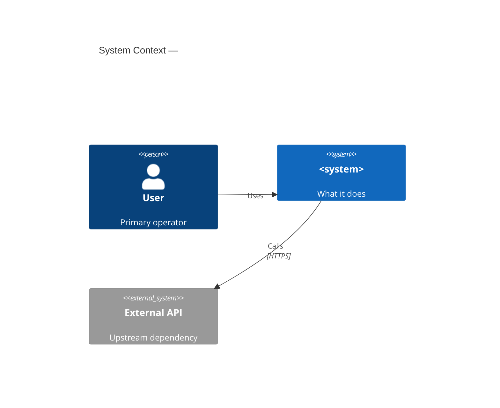
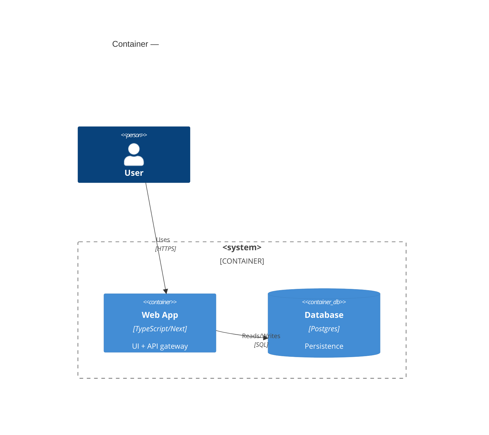

# C4 Architecture (original, local-first)

Produce a **C4 model** of any codebase in four levels of detail. The diagrams are
generated by *analyzing the repo ourselves* (README, entry points, dependency
manifests, `astGrep` for module boundaries) and emitted as Mermaid — never by
installing a third-party tool. Every diagram is validated with `mermaid-fixer`
and indexed with `context-mode` for later retrieval.

## The four levels

| Level | Diagram | Answers | Mermaid type |
|-------|---------|---------|--------------|
| 1 | **System Context** | Who/what interacts with the system at the boundary? | `C4Context` |
| 2 | **Container** | What deployable units (apps, services, DBs, queues) make it up? | `C4Container` |
| 3 | **Component** | What modules/components live inside the main container? | `C4Component` |
| 4 | **Code** | Key classes/interfaces of the most important component? | `classDiagram`* |

\* Mermaid has no `C4Code` primitive; level 4 uses a `classDiagram`
(relationships = associations/dependencies).

## How to derive each level from the code (our tools only)

### Level 1 — System Context
- Read `README.md`, top-level dirs, and config for external signals:
  CORS origins, OAuth providers, `API_URL` env vars, webhook endpoints.
- Each external **actor** (user role, other system) becomes a `Person` / `System_Ext`.
- The system under study is one `System`/`System_Boundary`.

### Level 2 — Container
- Scan dependency manifests & infra for deployable units:
  - `package.json` / `Cargo.toml` / `pom.xml` / `requirements.txt` → language/runtime
  - `Dockerfile`, `docker-compose.yml`, `Procfile` → services
  - DB drivers, Redis, message brokers in deps → `ContainerDb` / `ContainerQueue`
- Each unit = a `Container` inside a `System_Boundary` or `Container_Boundary`.

### Level 3 — Component
- For the main container, `astGrep`/read to find module boundaries:
  `src/**/`, exported modules, route handlers, `controller`/`service`/`repository` dirs.
- Each cohesive module = a `Component` inside a `Container_Boundary`.

### Level 4 — Code
- Pick the **single most important** component from level 3.
- `astGrep` for class/interface/struct/type definitions and their relationships.
- Emit a `classDiagram` (do not try to diagram the whole codebase — one component only).

## Mermaid C4 syntax

See `assets/c4-templates.md` for copy-paste scaffolds of all four levels.
Minimal examples:





## Workflow (the gate)

1. **Analyze** the repo per the level-1..4 signals above. Do NOT dump the whole
   tree into context — use `context-architecture` scaling (README + entry +
   targeted `astGrep`).
2. **Generate** one `.mmd` per level under `.c4/`:
   `.c4/context.mmd`, `.c4/container.mmd`, `.c4/component.mmd`, `.c4/code.mmd`.
3. **Validate** — run the `mermaid-fixer` skill's validator:
   ```bash
   node <mermaid-fixer-skill-dir>/assets/validate-mermaid.mjs .c4/*.mmd
   ```
   Fix every reported error and re-run until exit code `0`.
4. **Index** for retrieval (feeds `context-architecture` S1 tier):
   ```js
   context-mode_ctx_index(path: ".c4/context.mmd", source: "architecture")
   ```
   Tag all four with `source: "architecture"` so
   `ctx_search(queries:[...], source:"architecture")` surfaces them to agents.
5. **Wrap** (optional): write `.c4/README.md` linking the four levels, then point
   `cavekit-docgen`'s `architecture.md` at it.

## Integration

| Skill | Relationship |
|-------|--------------|
| `mermaid-fixer` | Mandatory validation gate (step 3). |
| `context-architecture` | C4 diagrams populate the S1 (ARCHITECTURE) tier. |
| `cavekit-docgen` | `architecture.md` references the generated C4 set. |
| `doc-knowledge-base` | For externally-sourced architecture docs, tag `source:"architecture"`. |

## Principles
- **Local-first**: no `npm install`, no cloud. Pure analysis + Mermaid.
- **Progressive disclosure**: level 1 is always safe to show; deeper levels only
  when the reader needs them.
- **Valid or not shipped**: a diagram that fails `mermaid-fixer` is a broken
  diagram — never commit it.
