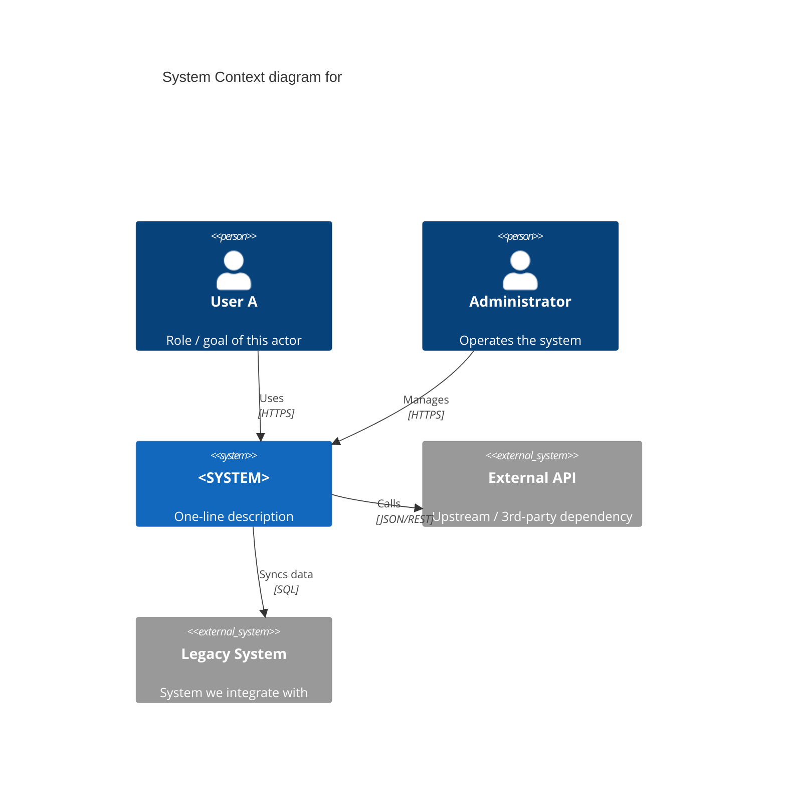
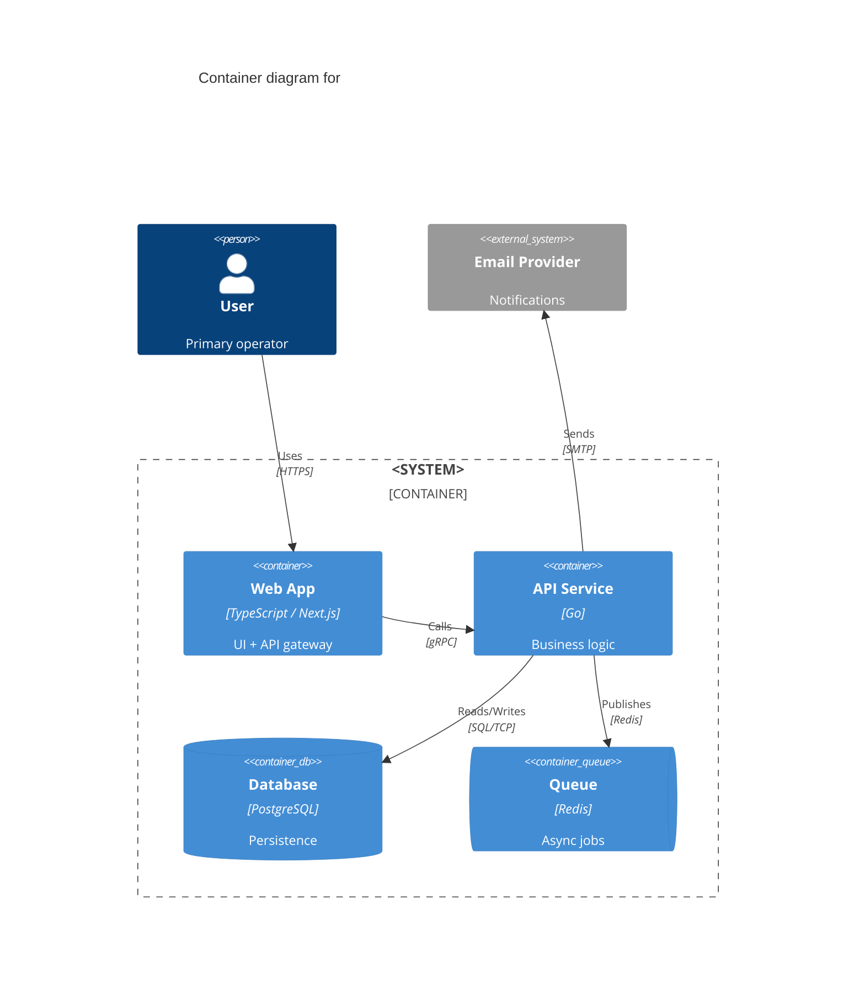
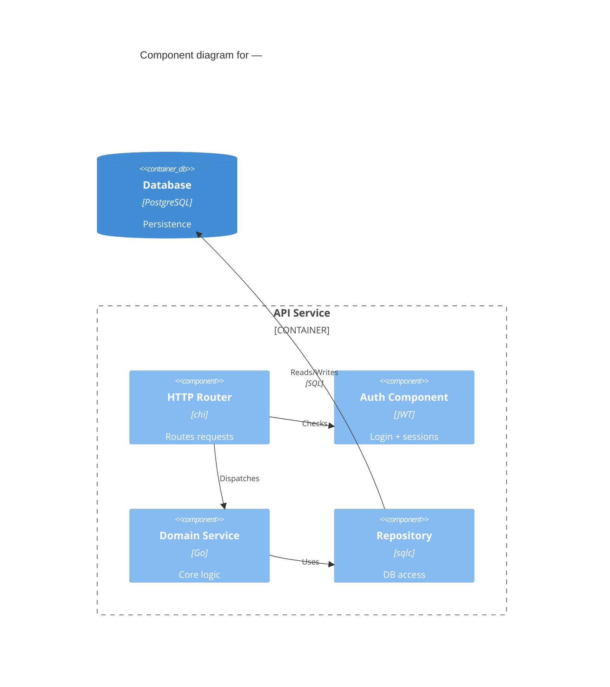
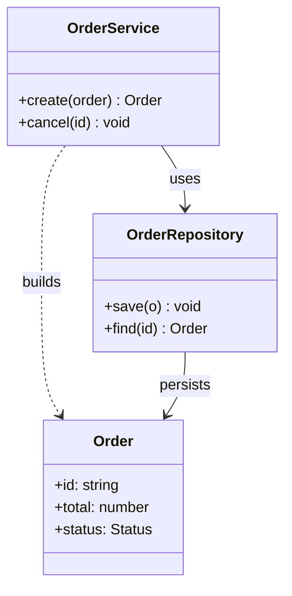

# C4 Diagram Templates (Mermaid)

Copy the relevant block, rename identifiers, and fill in the labels. Then run
`mermaid-fixer` on the file before committing.

## Level 1 — System Context (`C4Context`)

## Level 2 — Container (`C4Container`)

## Level 3 — Component (`C4Component`)

## Level 4 — Code (`classDiagram`)

Mermaid has no `C4Code` primitive; use a `classDiagram` for the single most
important component only.

## Notes
- Element ids must be unique within a diagram and contain no spaces.
- Labels with spaces go in quotes: `Person(u, "User Name", "desc")`.
- Relations: `Rel(from, to, "label", "tech")` for C4; `-->`, `..>` for class.
- After editing, run `mermaid-fixer` — it catches unknown types, unbalanced
  brackets, and edges with missing endpoints.
