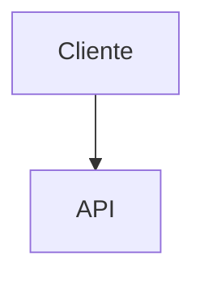

# Multi-language Support (i18n)

## Supported Languages
- `en` - English (default)
- `es` - Spanish (Español)

## Generate in Different Language

```
"generate wiki in Spanish"
"generar wiki en español"
"create documentation in English"
```

## Output Structure

```
.mini-wiki/
├── i18n/
│   ├── en/
│   │   ├── index.md
│   │   ├── architecture.md
│   │   └── wiki/
│   └── es/
│       ├── index.md
│       ├── architecture.md
│       └── wiki/
```

## Language Detection

1. Check for language in prompt
2. Check for `.i18nrc` or `i18n.config` file
3. Default to project language or English

## Translation Guidelines

When generating in non-English:
- Keep code examples in original language
- Translate comments and explanations
- Preserve technical terms in English
- Use consistent terminology

## Example: Spanish Wiki

### index.md (es)
```markdown
# Nombre del Proyecto

## Descripción
{descripción_en_español}

## Inicio Rápido
{instrucciones_en_español}
```

### architecture.md (es)
```markdown
# Arquitectura

## Diagrama del Sistema



## Componentes
{descripciones_en_español}
```