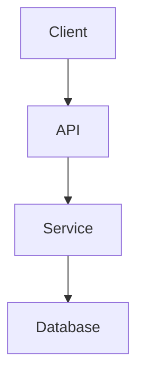

# Quality Standards for Wiki Documentation

## Content Requirements

### Minimum
- **Lines**: 100+ lines per module
- **Sections**: 5+ sections (overview, API, examples, diagrams, references)
- **Code Examples**: At least 1 working example

### Good
- **Lines**: 400+ lines per core module
- **Sections**: 10+ sections
- **Code Examples**: 3+ working examples
- **Diagrams**: 2+ Mermaid diagrams
- **Cross-links**: Links to related modules

### Excellent
- **Lines**: 800+ lines for main modules
- **Sections**: 16+ sections
- **Code Examples**: 5+ with multiple use cases
- **Diagrams**: Architecture + sequence + data flow diagrams
- **API Coverage**: All public functions documented
- **History**: Changelog section

## Diagram Requirements

### Required Diagrams
1. **Architecture Diagram** - System components and relationships
2. **Module Dependencies** - Import/export relationships

### Recommended Diagrams
3. **Data Flow** - How data moves through system
4. **Sequence** - Important interactions
5. **State** - State machines if applicable

### Mermaid Syntax

## Code Example Standards

### Must Have
- Language identifier
- Proper syntax highlighting
- Complete, runnable code
- Comments explaining key parts

### Should Have
- Multiple examples (happy path + edge cases)
- Output expectation
- Usage context

## Cross-Linking

Every section should link to:
- Related modules
- Related APIs
- External documentation

## Quality Check Checklist

- [ ] Module has 100+ lines
- [ ] At least 5 sections
- [ ] Code examples compile
- [ ] At least 1 Mermaid diagram
- [ ] Links to related modules
- [ ] No broken code references