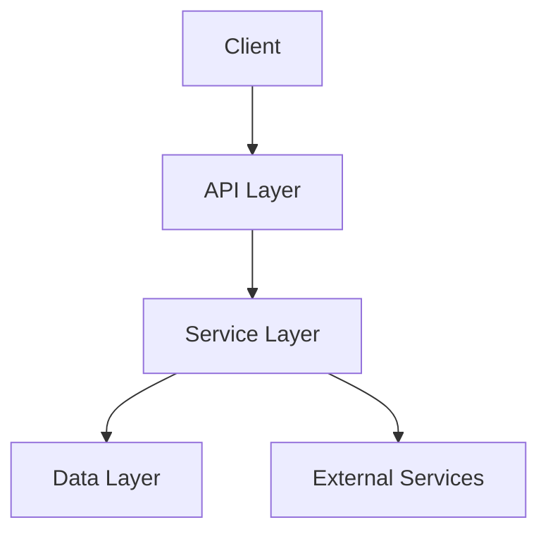
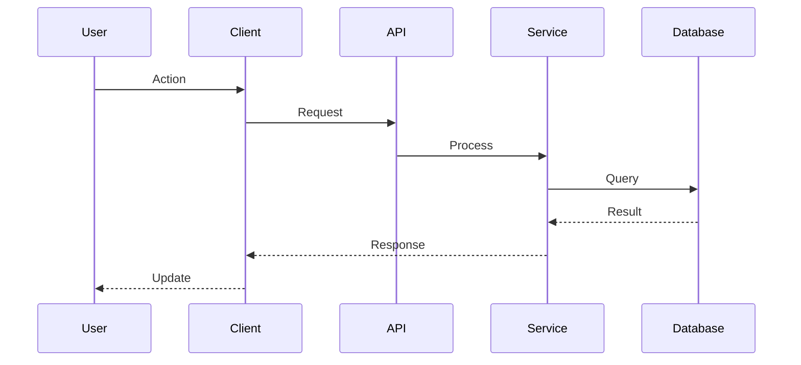
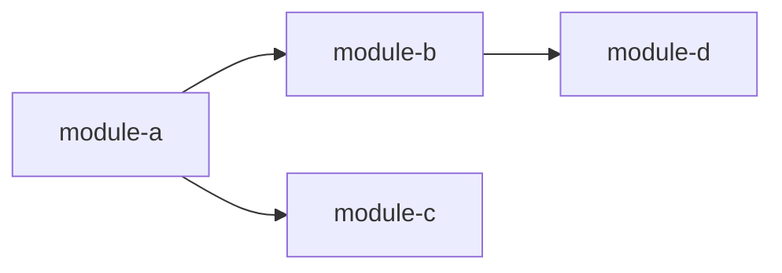

# Wiki Page Templates

## Homepage Template

```markdown
# {project_name}

{one_line_description}

## Badges


## Features
- {feature_1}
- {feature_2}
- {feature_3}

## Quick Start

```bash
# Install
npm install {package_name}

# Usage
import { main } from '{package_name}';
```

## Documentation

| Section | Description |
|---------|-------------|
| [Architecture](architecture.md) | System architecture and design |
| [API Reference](api/) | API documentation |
| [Modules](wiki/modules/) | Detailed module docs |

## Contributing
See [CONTRIBUTING.md](CONTRIBUTING.md)

## License
{MIT/Apache/Other}
```

---

## Architecture Template

```markdown
# Architecture

## Overview
{high_level_description}

## System Architecture



## Components

### Component Name
**Purpose:** {what it does}
**Location:** `{path}`

## Data Flow



## Dependencies



## Key Decisions
| Decision | Rationale |
|----------|-----------|
| {decision_1} | {reason_1} |
| {decision_2} | {reason_2} |
```

---

## Module Template

```markdown
# {module_name}

## Overview
{module_purpose_and_description}

## Installation
```bash
npm install {package_name}
```

## Quick Start
```typescript
import { function } from '{module_name}';

// Basic usage
const result = function(input);
```

## Core Concepts

### Concept Name
{Explanation of concept and when to use it}

## API Reference

### functionName()
```typescript
function functionName(param: Type): ReturnType
```
**Parameters:**
- `param` (Type): Description

**Returns:** Description

**Example:**
```typescript
const result = functionName({ key: 'value' });
```

## Configuration

| Option | Type | Default | Description |
|--------|------|---------|-------------|
| option1 | string | "default" | Description |

## Usage Examples

### Example 1: Basic
{code_and_explanation}

### Example 2: Advanced
{code_and_explanation}

## Troubleshooting

### Issue
{Comon issue}

### Solution
{How to fix it}

## Best Practices
- {practice_1}
- {practice_2}

## Related
- [Related Module](link)
- [Related API](link)
```

---

## API Reference Template

```markdown
# API Reference: {module_name}

## Overview
{Brief description of what this API provides}

## Functions

### functionName()
Signature: `function functionName(param: Type): ReturnType`

**Description:** What the function does

**Parameters:**
| Name | Type | Required | Description |
|------|------|----------|-------------|
| param | Type | Yes | Description |

**Returns:** What gets returned

**Throws:** Error type if applicable

**Example:**
```typescript
const result = functionName('input');
```

## Classes

### ClassName
**Description:** What the class does

#### constructor()
```typescript
new ClassName(options: Options)
```

#### Methods
- `method()` - Description

#### Properties
- `property` (Type): Description

## Types

### TypeName
```typescript
type TypeName = {
  property: Type;
};
```
```

---

## Config Template

```yaml
# .mini-wiki/config.yaml
project:
  name: "{project_name}"
  version: "{version}"
  language: "{language}"
  framework: "{framework}"

generation:
  incremental: true
  min_lines: 100
  quality_threshold: 0.7

plugins:
  enabled:
    - code-complexity
    - api-doc-enhancer

i18n:
  default: en
  supported:
    - en
    - es
```