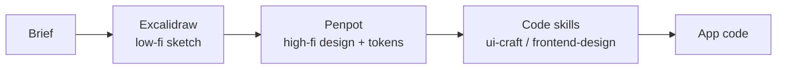

# Design Workflow — Shared Team Convention

## Activation Contract

Use at the START of any UI/page work to establish the agreed pipeline BEFORE producing
artifacts: landing pages, dashboards, auth flows, or any frontend surface. This is the
TEAM CONVENTION — agents and skills MUST follow it, not improvise a different flow.

Pipeline:

## Hard Rules

- UNIDIRECTIONAL: Excalidraw → Penpot → code. Never skip backward or run stages as
  competing sources of truth.
- ONE source of truth per stage. Excalidraw is NOT the design spec; Penpot is NOT the code.
- Excalidraw = low-fidelity ideation only (use the `excalidraw` skill). Hand-drawn on purpose.
- Penpot = high-fidelity design system + design tokens (CSS variables). External tool.
- Code = generated by ui-craft / frontend-design / design-prototype, consuming Penpot tokens
  via DESIGN.md or CSS variables (ui-craft already honors an external token source).
- The bridge between stages is HUMAN: confirm the artifact, then pass a brief forward.
- Never duplicate the design in two tools. If it lives in Penpot, consume its tokens — do not
  redraw from scratch in code.

## Decision Gates

| Stage | Tool | Output | Hands off to |
|-------|------|--------|--------------|
| Sketch / wireframe / flow / ER | `excalidraw` skill | `.excalidraw` | Penpot |
| High-fi design + tokens | Penpot | design + token JSON/CSS | code skills |
| Production code | ui-craft / frontend-design / design-prototype | app code | — |

Shortcut: a simple landing may skip Penpot (Excalidraw + code skills); a pure backend
diagram may stay in Excalidraw. Decide per brief, but never skip the human handoff.

## Execution Steps

1. Receive the brief; pick the stages needed.
2. Stage 1: if structure/flow is unclear, use the `excalidraw` skill to sketch.
3. Stage 2: convert the agreed sketch into a Penpot design; export design tokens.
4. Stage 3: feed tokens + brief to the code skills; they generate the implementation.
5. At every handoff, confirm with the user before advancing.

## Output Contract

- A clear statement of which stage the current task is in and the next handoff.
- Artifacts placed in the correct tool, never duplicated.

## References

- `skills/excalidraw/SKILL.md` — low-fidelity sketch skill.
- `skills/ui-craft/SKILL.md`, `skills/frontend-design/SKILL.md`, `skills/design-prototype/SKILL.md` — code generation.
- Penpot (https://github.com/penpot/penpot) — high-fidelity design + tokens (external, open source).
