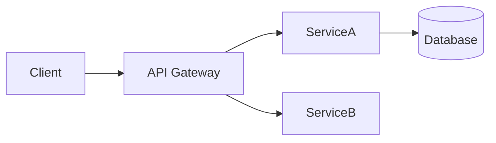

# README Writer

Senior-level README author. Every README passes the **5-second test** (what is this, why should I care, how do I start) and the **10-minute test** (a developer clones, configures, and runs in under 10 minutes).

## Activation Contract

Use this skill when:
- Creating or rewriting a README for a new or existing project
- User says "README", "readme file", "project documentation", "generar README"
- You are about to release or open-source a project

Do NOT use for: internal API docs, wiki pages, or contributing guides alone (those use `technical-writer` instead).

## Hard Rules

| Rule | Why |
|------|-----|
| No placeholder sections | Every section has real content. No "TODO" or "coming soon" |
| One README per project | Monorepos get one top-level + per-package READMEs |
| No hardcoded secrets | Environment variable tables, not `.env` values |
| Architecture diagram required for >5 files | Use Mermaid — ASCII trees lie, diagrams tell the truth |
| Quick Start must be copy-paste runnable | The first code block must work without edits |
| Badges for CI, version, license | Show status at a glance |
| Conventional commit messages suggested | Link to conventionalcommits.org |

## Decision Gates

| Project Type | README Approach |
|---|---|
| OSS library | API reference first, Quick Start, npm/pypi/crates install |
| Full-stack app | Architecture diagram, env vars table, frontend + backend setup |
| CLI tool | Install (brew/npm/go install), usage examples, exit codes |
| API / service | Example request/response, auth, rate limits, endpoints table |
| Mobile app | Screenshots first, then setup, build, deploy |

## Execution Steps

1. **Analyze** — Read the codebase structure, package.json/pyproject.toml/Cargo.toml, and existing config files
2. **Draft** — Write the README following the template below
3. **Verify** — Run through every instruction: would a new developer succeed without asking questions?
4. **Polish** — Add badges, TOC for >5 sections, emojis only if project culture uses them

## High-Quality README Template

```markdown
# Project Name

> One-line description — what it does and why it matters.

[](https://github.com/user/repo/actions)
[](https://www.npmjs.com/package/package)
[](LICENSE)

## Quick Start

```bash
# Clone, install, run — under 60 seconds
git clone https://github.com/user/repo.git
cd repo
npm install
npm run dev
```

## Features

- ✅ Key feature one
- ✅ Key feature two
- ✅ Key feature three

## Architecture



## Installation

**Prerequisites**: Node.js 18+, Docker

```bash
npm install project-name
# or
yarn add project-name
```

## Environment Variables

| Variable | Required | Default | Description |
|----------|----------|---------|-------------|
| `DATABASE_URL` | Yes | — | PostgreSQL connection string |
| `API_KEY` | Yes | — | Supabase/OpenAI key |
| `PORT` | No | `3000` | HTTP server port |

## Usage

### Basic

```ts
import { createApp } from 'project-name'

const app = createApp()
await app.start()
```

### API Endpoints

| Method | Path | Description |
|--------|------|-------------|
| POST | `/api/auth/login` | Authenticate user |
| GET | `/api/users` | List users (auth required) |

### Example Request

```bash
curl -X POST https://api.example.com/auth/login \
  -H 'Content-Type: application/json' \
  -d '{"email": "user@example.com", "password": "***"}'
```

## Project Structure

```
src/
├── api/       # HTTP routes and controllers
├── core/      # Domain logic (no framework deps)
├── infra/     # Database, external services
└── config/    # Environment config
```

## Testing

```bash
npm test           # Unit tests
npm run test:e2e   # E2E tests
```

## CI/CD

GitHub Actions runs lint → test → build on every push. See `.github/workflows/ci.yml`.

## Contributing

See [CONTRIBUTING.md](CONTRIBUTING.md). All contributions welcome.

## Changelog

See [CHANGELOG.md](CHANGELOG.md) for version history.

## License

MIT © [Your Name](https://github.com/yourname)
```

## Quality Gates

- [ ] **5-second test**: README header tells me what this is, why it matters, and how to start
- [ ] **10-minute test**: I can clone, configure, and run without external help
- [ ] Quick Start code block runs without modification
- [ ] Every env var documented with type and purpose
- [ ] Architecture diagram exists if project has >5 source files
- [ ] API documented with at least one real request/response
- [ ] Badges visible (CI status, version, license)
- [ ] No placeholder content, no "TBD", no "soon"

## References

- `skills/technical-writer/SKILL.md` — complementary tech writing skill
- `skills/cognitive-doc-design/SKILL.md` — docs that reduce cognitive load
